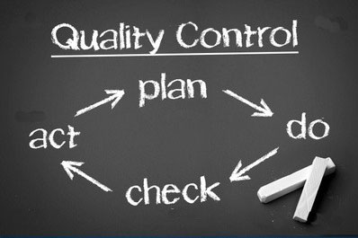

## Фундаментальный процесс тестирования

Как мы увидели, исполнение тестов необходимо, но не менее важны и сопровождающие действия – планирование и
документирование процесса. В обязанности тестировщиков входит разработка тестовых сценариев, а также подготовка
тестирования и оценка его результатов. Становление идеи фундаментального тестового процесса на всех уровнях тестирования
заняло годы. В рамках этого процесса можно выделить ключевые шаги:

- планирование и управление;

- анализ и проектирование;

- внедрение и реализация;

- оценка критериев выхода и написание отчетов;

- действия по завершению тестирования.

Здесь действия описаны в логической последовательности, но в условиях реального проекта они могут накладываться,
происходить одновременно или даже повторяться. Обычно, происходит адаптация этих шагов под нужды конкретной системы или
проекта. Рассмотрим их.

**1. Планирование и управление**

Планирование тестирования включает действия, направленные на определение основных целей тестирования и задач, выполнение
которых необходимо для достижения этих целей.

В процессе планирования мы убеждаемся в том, что мы правильно поняли цели и пожелания заказчика и объективно оценили
уровень риска для проекта, после чего ставим цели и задачи для, собственно, тестирования.

Для более ясного описания целей и задач тестирования составляются такие документы как тест-политика, тест-стратегия и
тест-план.

Тест-политика – высокоуровневый документ, описывающий принципы, подходы и основные цели компании в сфере тестирования.

Тест-стратегия – высокоуровневый документ, содержащий описание уровней тестирования и подходов к тестированию в пределах
этих уровней. Действует на уровне компании или программы (одного или больше проектов).

Тест-план – документ, описывающий средства, подходы, график работ и ресурсы, необходимые для проведения тестирования.
Помимо прочего, определяет инструменты тестирования, функциональность, которую требуется протестировать, распределение
ролей в команде, тестовое окружение, используемые техники тест-дизайна, критерии начала и окончания тестирования и
риски. То есть, это подробное описание всего процесса тестирования.

В любой деятельности, управление не заканчивается планированием. Нам нужно контролировать и измерять прогресс. Именно
поэтому управление тестированием – непрерывный процесс.

Управление тестированием – сопоставление текущей ситуации в процессе тестирования с планом и составление отчетности.

В свою очередь, данные, полученные в ходе контроля над процессом, учитываются при планировании дальнейших действий.

**2. Анализ и проектирование**

Анализ и проектирование тестов – это процесс написания тестовых сценариев и условий на основе общих целей тестирования.

В процессе анализа и проектирования мы разрабатываем тестовые сценарии на основании общих целей тестирования,
определенных во время планирования.

Тестовый сценарий – документ, определяющий установленную последовательность действий при выполнении тестирования.

**3. Внедрение и реализация**

Во время выполнения тестирования происходит написание тест-кейсов, на основе написанных ранее тестовых сценариев,
собирается необходимая для проведения тестов информация, подготавливается тестовое окружение и запускаются тесты.

Тест-кейс – документ, содержащий набор входных значений, пред- и постусловий, а также ожидаемый результат проведения
теста, разработанный для проверки соответствия определенной функциональности системы заданным для этой функциональности
требованиям.

Тестовое окружение – аппаратное и программное обеспечение и другие средства, необходимые для выполнения тестов.

**4. Оценка критериев выхода и написание отчетов**

Критерии выхода определяют, когда можно завершать тестирование. Они необходимы для каждого уровня тестирования,
поскольку нам необходимо знать, достаточно ли было проведено тестов.

При оценке критериев выхода необходимо:

- проверить, было ли проведено достаточное количество тестов, достигнута ли нужная степень обеспечения качества системы.

- убедится в том, что нет необходимости проводить дополнительные тесты. Если все же такая необходимость есть, возможно,
  потребуется изменить установленный критерий выхода.

После окончания тестирования происходит написание отчета, который будет доступен всем заинтересованным сторонам. Ведь не
только тестировщики должны знать результаты выполнения тестов, – эта информация может быть необходима многим участникам
процесса создания ПО.

**5. Действия по завершению тестирования**

При завершении тестирования мы собираем, систематизируем и анализируем информацию о его результатах. Она может
пригодиться позже – при выпуске готового продукта. Могут быть и другие причины для сворачивания тестирования, например,
досрочное закрытие проекта или завершение определенного этапа разработки.

Основные цели этого этапа:

- убедиться, что вся запланированная функциональность действительно была реализована;

- проверить, что все отчеты об ошибках, поданные ранее, были, так или иначе, закрыты;

- завершение работы тестового обеспечения, тестового окружения и инфраструктуры;

- оценить общие результаты тестирования и проанализировать опыт, полученный в его процессе.