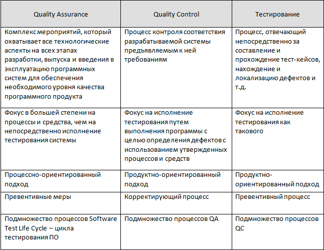
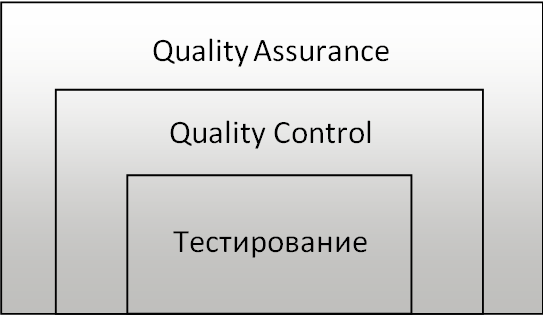

## QA, QC и тестирование

Так в чем же разница между QA и тестированием, и что такое Quality Control?

Многие люди до сих пор путают эти понятия, что, в общем-то, и не удивительно, принимая во внимание, что в нашей стране
они зачастую могут использоваться для описания одних и тех же процессов. Но с формальной точки зрения, а именно она нас,
как специалистов и интересует, эти три понятия имеют существенно отличающиеся значения.

Можно оформить их соотношение в виде таблицы:

Таким образом, мы можем построить модель иерархии процессов обеспечения качества: Тестирование – часть QC. QC – часть
QA.

Иными словами, Quality Assurance обеспечивает правильность и предсказуемость процесса, в то время как Quality Control
предполагает контроль соблюдения требований. Тестирование же, в свою очередь, обеспечивает сбор статистических данных и
внесение их в документы, созданные в рамках QC-процесса.

Если провести аналогию с процессом конструирования, скажем, велосипеда, получим такую картину:

- с помощью тестирования мы можем определить, работают ли все детали и сам велосипед в целом так, как мы ожидаем. Из
  правильных ли материалов он сделан, с применением нужных методик и инструментов или нет. То есть, подразумевается, что
  тестируемый объект уже существует.
- задачей же QA является обеспечение соответствия всех этапов конструирования нашего велосипеда определенным стандартам
  качества, начиная с планирования и создания чертежей и заканчивая сборкой уже готового велосипеда. То есть, качеству
  объекта внимание уделяется еще до создания самого объекта.