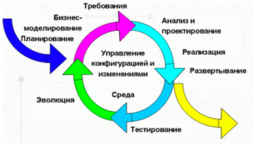

## Итеративная модель (Iterative model)

Не все модели жизненного цикла последовательны. Существуют также итеративные (или инкрементальные) модели, в которых используется другой подход. Вместо одной продолжительной последовательности действий здесь весь жизненный цикл продукта разбит на ряд отдельных мини-циклов. Причем каждый из них состоит из все тех же базовых стадий модели жизненного цикла. Эти мини-циклы называются итерациями. В каждой из итераций происходит разработка отдельного компонента системы, после чего этот компонент добавляется к уже ранее разработанному функционалу.

Итеративная модель не предполагает полного объема требований для начала работ над продуктом. Разработка программы может начинаться с требований к части функционала, которые могут впоследствии дополняться и изменяться.  Процесс повторяется, обеспечивая создание новой версии продукта для каждого цикла.

В несколько упрощенном виде, итеративная модель состоит из четырех основных стадий, которые повторяются в каждой из итераций (plan-do-check-act):

- определение и анализ требований;

- дизайн и проектирование – согласно требованиями. Причем дизайн может как разрабатываться отдельно для данной функциональности, так и дополнять уже существующий;

- разработка и тестирование – кодирование, интеграция и тестирование нового компонента;

- фаза ревью – оценка, пересмотр текущих требований и предложения дополнений к ним.

По результатам каждой итерации принимается решение – будут ли использованы ее результаты для дополнения существующей функциональности в качестве входной точки для начала следующей итерации (т.н. инкрементальное прототипирование). В конечном итоге, достигается точка, в которой все требования были воплощены в продукте – происходит релиз.

В математических терминах, итеративная модель представляет реализацию методики  последовательной аппроксимации – то есть, постепенное приближение к образу готового продукта:

Ключ к успешному использованию этой модели – строгая валидация требований и тщательная верификация разрабатываемой функциональности в каждой из итераций.

Основные стадии процесса разработки в итеративной модели фактически повторяют модель водопада. В каждой итерации создается программное обеспечение, требующее тестирования на всех уровнях.

Плюсы и минусы итеративной модели:

[+] раннее создание работающего ПО;

[+] гибкость – готовность к изменению требований на любом этапе разработки;

[+] каждая итерация – маленький этап, для которого тестирование и анализ рисков обеспечить проще, чем для всего жизненного цикла продукта.

[—] каждая фаза – самостоятельна, отдельные итерации не накладываются;

[—] могут возникнуть проблемы с реализацией общей архитектуры системы, поскольку не все требования известны к началу проектирования.

Когда использовать итеративную модель:

- для крупных проектов;

- когда известны, по крайней мере, ключевые требования;

- когда требования к проекту могут меняться в процессе разработки.

Итеративная модель ­является ключевым элементом так называемых «гибких» (Agile) подходов к разработке программного обеспечения, основные из которых мы рассмотрим в следующих разделах.