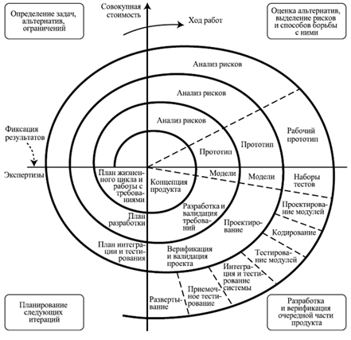

## Спиральная модель (Spiral model)

Спиральная модель представляет шаблон процесса разработки ПО, который сочетает идеи итеративной и каскадной моделей.
Суть ее в том, что весь процесс создания конечного продукта представлен в виде условной плоскости, разбитой на 4
сектора, каждый из которых представляет отдельные этапы его разработки: определение целей, оценка рисков, разработка и
тестирование, планирование новой итерации.

В спиральной модели жизненный путь разрабатываемого продукта изображается в виде спирали, которая, начавшись на этапе
планирования, раскручивается с прохождением каждого следующего шага. Таким образом, на выходе из очередного витка мы
должны получить готовый протестированный прототип, который дополняет существующий билд. Прототип, удовлетворяющий всем
требованиям – готов к релизу.

Главная особенность спиральной модели – концентрация на возможных рисках. Для их оценки даже выделена соответствующая
стадия. Основные типы рисков, которые могут возникнуть в процессе разработки ПО:

- Нереалистичный бюджет и сроки;

- Дефицит специалистов;

- Частые изменения требований;

- Чрезмерная оптимизация;

- Низкая производительность системы;

- Несоответствие уровня квалификации специалистов разных отделов.

Плюсы и минусы спиральной модели:

[+] улучшенный анализ рисков;

[+] хорошая документация процесса разработки;

[+] гибкость – возможность внесения изменений и добавления новой функциональности даже на относительно поздних этапах;

[+] раннее создание рабочих прототипов.

[—] может быть достаточно дорогой в использовании;

[—] управление рисками требует привлечения высококлассных специалистов;

[—] успех процесса в большой степени зависит от стадии анализа рисков;

[—] не подходит для небольших проектов.

Когда использовать спиральную модель:

- когда важен анализ рисков и затрат;

- крупные долгосрочные проекты с отсутствием четких требований или вероятностью их динамического изменения;

- при разработке новой линейки продуктов.