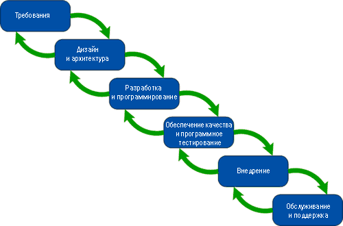

## Жизненный цикл ПО

Тестирование – не изолированный процесс. Это часть модели жизненного цикла программного обеспечения (Software
Development Life Cycle, SDLC). Именно поэтому выбор средств и методик тестирования будет напрямую зависеть от выбранной
модели разработки. В этом разделе мы рассмотрим наиболее часто применяемые подходы к разработке программного
обеспечения, а также популярные сегодня методологии и практики, такие как Agile и Scrum.

Жизненный цикл программного обеспечения (также называемый циклом разработки) – это условная схема, включающая отдельные
этапы, которые представляют стадии процесса создания ПО. При этом на каждом этапе выполняются разные действия.

Цикл разработки предлагает шаблон, использование которого облегчает проектирование, создание и выпуск качественного
программного обеспечения. Это методология, определяющая процессы и средства, необходимые для успешного завершения
проекта.

Хотя реализация принципов построения модели жизненного цикла для разных компаний может существенно отличаться,
существуют стандарты, такие как ISO/IEC 12207, определяющие принятые практики разработки и сопровождения программного
обеспечения.

Цель использования модели жизненного цикла – создать эффективный, экономически выгодный и качественный программный
продукт.

