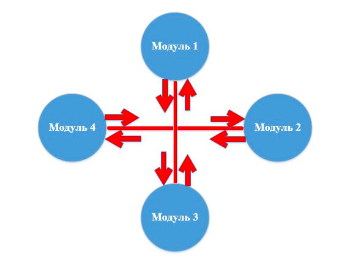

## Интеграционное тестирование

Исходя из различий между модульным тестированием и системным тестированием, интеграционное тестирование является
переходным этапом между представлением программы в виде отдельных модулей в вид полностью функциональной системы.

**Интеграционное тестирование** – вид тестирования, при котором на соответствие требований проверяется интеграция
модулей, их взаимодействие между собой, а также интеграция подсистем в одну общую систему. Для интеграционного
тестирования используются компоненты, уже проверенные с помощью модульного тестирования, которые группируются в
множества. Данные множества проверяются в соответствии с планом тестирования, составленным для них, а объединяются они
через свои интерфейсы.

Так как модули соединяются между собой с помощью предусмотренных реализацией интерфейсов и в процессе тестирования у нас
нет потребности рассматривать внутреннюю структуру компонентов, можно утверждать, что интеграционное тестирование
выполняется методом «черного ящика».

Объект тестирования выделен красным цветом.

**Существует несколько подходов к интеграционному тестированию:**

- Снизу вверх. Сначала собираются и тестируются модули самих нижних уровней, а затем по возрастанию к вершине иерархии.
  Данный подход требует готовности всех собираемых модулей на всех уровнях системы.

- Сверху вниз. Данный подход предусматривает движение с высокоуровневых модулей, а затем направляется вниз. При этом
  используются заглушки для тех модулей, которые находятся ниже по уровню, но включение которых в тест еще не произошло.

- Большой взрыв. Все модули всех уровней собираются воедино, а затем тестируется. Данный метод экономит время, но
  требует тщательной проработки тест кейсов.

**При автоматизации тестирования используется Система непрерывной интеграции. Принцип ее действия заключается в
следующем:**

1) Система непрерывной интеграции производит мониторинг системы контроля версий.

2) При изменении исходных кодов в репозитории производится обновление локального хранилища.

3) Выполняются необходимые проверки и модульные тесты.

4) Исходные коды компилируются в готовые выполняемые модули.

5) Выполняются тесты интеграционного уровня.

6) Генерируется отчет о тестировании.

Это позволяет тестировать систему сразу после внесения изменений, что существенно сокращает время обнаружения и
исправления ошибок.