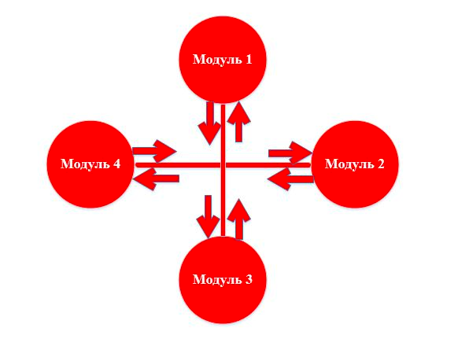

## Системное тестирование

**Системное тестирование** – это тестирование программного обеспечения выполняемое на полной, интегрированной системе, с
целью проверки соответствия системы исходным требованиям, как функциональным, так и не функциональным.

Объект тестирования выделен красным цветом.

Выполняя системное тестирование, можно обнаружить следующие типы дефектов:

- Неправильное использование системных ресурсов.

- Непредусмотренные комбинации пользовательских данных.

- Проблемы с совместимостью окружения.

- Непредусмотренные сценарии использования.

- Несоответствие с функциональными требованиями.

- Плохое удобство использования.

Системное тестирование выполняется методом «Черного ящика», т.к. проверяемое множество является «внешними» сущностями,
которые не требуют взаимодействия с внутренним устройством программы. Также выполнять его рекомендуется в окружении,
максимально приближенном к окружению конечного пользователя.

Можно выделить 2 подхода к системному тестированию:

- **На базе требований.** Тестирование проводится в соответствии с функциональными или нефункциональными требованиями,
  для каждого из которых пишется testcase (тестовые прецеденты).

- **На базе случаев использования.** Тестирование происходит в соответствии с вариантами использования продукта, на
  основе которых создаются usercases (пользовательские прецеденты). Для каждого из данных пользовательских прецедентов
  создаются свои тестовые прецеденты.

Также к системному тестированию можно отнести альфа-тестирование и бета-тестирование, суть которых мы рассмотрим в
следующих статьях.