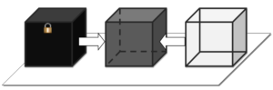
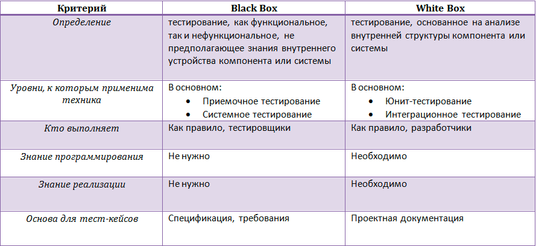

## White/Black/Grey Box-тестирование

Для того чтобы лучше понимать подходы к тестированию программного обеспечения, нужно, конечно же, знать, какие виды и
типы тестирования в принципе бывают. Давайте начнем с рассмотрения основных типов тестирования, которые определяют
высокоуровневую классификацию тестов.

Самым высоким уровнем в иерархии подходов к тестированию будет понятие **типа**, которое может охватывать сразу
несколько смежных техник тестирования. То есть, **одному типу тестирования может соответствовать несколько его видов.**
Рассмотрим, для начала несколько типов тестирования, которые отличаются знанием внутреннего устройства объекта
тестирования.

**Black Box**

**Summary: Мы не знаем, как устроена тестируемая система.**

Тестирование методом «черного ящика», также известное как тестирование, основанное на спецификации или тестирование
поведения – техника тестирования, основанная на работе исключительно с внешними интерфейсами тестируемой системы.

Согласно ISTQB:

**тестирование черного ящика – это:**

- тестирование, как функциональное, так и нефункциональное, не предполагающее знания внутреннего устройства компонента
  или системы.

- тест-дизайн, основанный на технике черного ящика – процедура написания или выбора тест-кейсов на основе анализа
  функциональной или нефункциональной спецификации компонента или системы без знания ее внутреннего устройства.

Почему именно «черный ящик»? Тестируемая программа для тестировщика – как черный непрозрачный ящик, содержания которого
он не видит. Целью этой техники является поиск ошибок в таких категориях:

- неправильно реализованные или недостающие функции;

- ошибки интерфейса;

- ошибки в структурах данных или организации доступа к внешним базам данных;

- ошибки поведения или недостаточная производительность системы;

Таким образом, мы не имеем представления о структуре и внутреннем устройстве системы. Нужно концентрироваться на том,
что программа делает, а не на том, как она это делает.

**Пример:**

Тестировщик проводит тестирование веб-сайта, не зная особенностей его реализации, используя только предусмотренные
разработчиком поля ввода и кнопки. Источник ожидаемого результата – спецификация.

Поскольку это тип тестирования, по определению он может включать другие его виды. Тестирование черного ящика может быть
как функциональным, так и нефункциональным. Функциональное тестирование предполагает проверку работы функций системы, а
нефункциональное – соответственно, общие характеристики нашей программы.

Техника черного ящика применима на всех уровнях тестирования (от модульного до приемочного), для которых существует
спецификация. Например, при осуществлении системного или интеграционного тестирования, требования или функциональная
спецификация будут основой для написания тест-кейсов.

Техники тест-дизайна, основанные на использования черного ящика, включают:

- классы эквивалентности;

- анализ граничных значений;

- таблицы решений;

- диаграммы изменения состояния;

- тестирование всех пар.

**Преимущества:**

- тестирование производится с позиции конечного пользователя и может помочь обнаружить неточности и противоречия в
  спецификации;

- тестировщику нет необходимости знать языки программирования и углубляться в особенности реализации программы;

- тестирование может производиться специалистами, независимыми от отдела разработки, что помогает избежать предвзятого
  отношения;

- можно начинать писать тест-кейсы, как только готова спецификация.

**Недостатки:**

- тестируется только очень ограниченное количество путей выполнения программы;

- без четкой спецификации (а это скорее реальность на многих проектах) достаточно трудно составить эффективные
  тест-кейсы;

- некоторые тесты могут оказаться избыточными, если они уже были проведены разработчиком на уровне модульного
  тестирования;

Противоположностью техники черного ящика является тестирование методом белого ящика, речь о котором пойдет ниже.

**White Box**

**Summary: Нам известны все детали реализации тестируемой программы.**

Тестирование методом белого ящика (также: прозрачного, открытого, стеклянного ящика; основанное на коде или структурное
тестирование) – метод тестирования программного обеспечения, который предполагает, что внутренняя
структура/устройство/реализация системы известны тестировщику. Мы выбираем входные значения, основываясь на знании кода,
который будет их обрабатывать. Точно так же мы знаем, каким должен быть результат этой обработки. Знание всех
особенностей тестируемой программы и ее реализации – обязательны для этой техники. Тестирование белого ящика –
углубление во внутренне устройство системы, за пределы ее внешних интерфейсов.

Согласно ISTQB:

**тестирование белого ящика – это:**

- тестирование, основанное на анализе внутренней структуры компонента или системы.

- тест-дизайн, основанный на технике белого ящика – процедура написания или выбора тест-кейсов на основе анализа
  внутреннего устройства системы или компонента.

Почему «белый ящик»? Тестируемая программа для тестировщика – прозрачный ящик, содержимое которого он прекрасно видит.

**Пример:**

Тестировщик, который, как правило, является программистом, изучает реализацию кода поля ввода на веб-странице,
определяет все предусмотренные (как правильные, так и неправильные) и не предусмотренные пользовательские вводы, и
сравнивает фактический результат выполнения программы с ожидаемым. При этом ожидаемый результат определяется именно тем,
как должен работать код программы.

Тестирование методом белого ящика похоже на работу механика, который изучает двигатель машины, чтобы понять, почему она
не заводится.

Техника белого ящика применима на разных уровнях тестирования – от модульного до системного, но главным образом
применяется именно для реализации модульного тестирования компонента его автором.

**Преимущества:**

- тестирование может производиться на ранних этапах: нет необходимости ждать создания пользовательского интерфейса;

- можно провести более тщательное тестирование, с покрытием большого количества путей выполнения программы.

**Недостатки:**

- для выполнения тестирования белого ящика необходимо большое количество специальных знаний

- при использовании автоматизации тестирования на этом уровне, поддержка тестовых скриптов может оказаться достаточно
  накладной, если программа часто изменяется.

**Сравнение Black Box и White Box**

**Grey Box**

Summary: Нам известны только некоторые особенности реализации тестируемой системы.

Тестирование методом серого ящика – метод тестирования программного обеспечения, который предполагает, комбинацию White
Box и Black Box подходов. То есть, внутреннее устройство программы нам известно лишь частично. Предполагается, например,
доступ к внутренней структуре и алгоритмам работы ПО для написания максимально эффективных тест-кейсов, но само
тестирование проводится с помощью техники черного ящика, то есть, с позиции пользователя.

Эту технику тестирования также называют методом полупрозрачного ящика: что-то мы видим, а что-то – нет.

**Пример:**

Тестировщик изучает код программы с тем, чтобы лучше понимать принципы ее работы и изучить возможные пути ее выполнения.
Такое знание поможет написать тест-кейс, который наверняка будет проверять определенную функциональность.

Техника серого ящика применима на разных уровнях тестирования – от модульного до системного, но главным образом
применяется на интеграционном уровне для проверки взаимодействия разных модулей программы.