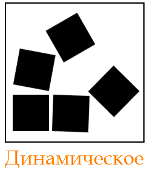

## Статическое и динамическое тестирование

По критерию запуска программы (исполняется ли программный код) выделяют еще два типа тестирования: статическое и
динамическое.

**Статическое тестирование** – тип тестирования, который предполагает, что программный код во время тестирования не
будет выполняться. При этом само тестирование может быть как ручным, так и автоматизированным.

Статическое тестирование начинается на ранних этапах жизненного цикла ПО и является, соответственно, частью процесса
верификации. Для этого типа тестирования в некоторых случаях даже не нужен компьютер – например, при проверке
требований.

Большинство статических техник могут быть использованы для «тестирования» любых форм документации, включая вычитку кода,
инспекцию проектной документации, функциональной спецификации и требований.

Даже статическое тестирование может быть автоматизировано – например, можно использовать автоматические средства
проверки синтаксиса программного кода.

**Виды статического тестирования:**

- вычитка исходного кода программы;

- проверка требований.

**Динамическое тестирование** – тип тестирования, который предполагает запуск программного кода. Таким образом,
анализируется поведение программы во время ее работы.

Для выполнения динамического тестирования необходимо чтобы тестируемый программный код был написан, скомпилирован и
запущен. При этом, может выполняться проверка внешних параметров работы программы: загрузка процессора, использование
памяти, время отклика и т.д. – то есть, ее производительность.

Динамическое тестирование является частью процесса валидации программного обеспечения.

Кроме того динамическое тестирование может включать разные подвиды, каждый из которых зависит от:

- Доступа к коду (тестирование черным, белым и серым ящиками).

- Уровня тестирования (модульное, интеграционное, системное и приемочное тестирование).

- Сферы использования приложения (функциональное, нагрузочное, тестирование безопасности и пр.).