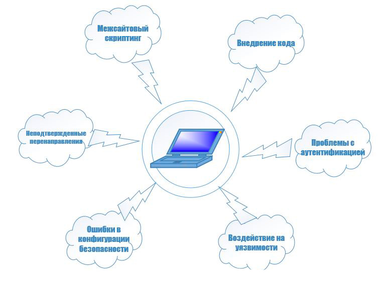

## Тестирование безопасности

**Тестирование безопасности** – комплекс исследований программного продукта, направленный на тестирование, обнаружение и
исправление дефектов, связанных с сохранностью пользовательских данных, а именно:

**Целостность**. Ограничение круга пользователей, имеющих доступ к данным, определение степени вреда, нанесенного при
потере тех или иных данных.

**Доступность**. Представляет собой требования о том, что ресурсы должны быть доступны авторизованному пользователю,
внутреннему объекту или устройству. Как правило, чем более критичен ресурс тем выше уровень доступности должен быть.

**Конфиденциальность**. Сокрытие определенных ресурсов или информации. Под конфиденциальностью можно понимать
ограничение доступа к ресурсу некоторой категории пользователей, или другими словами, при каких условиях пользователь
авторизован получить доступ к данному ресурсу.

В ходе тестирования, чаще всего тестировщик играет роль взломщика, и начинает манипулировать разным образом приложением:

- Попытки узнать пароль с помощью внешних средств.

- Атака системы с помощью специальных утилит, анализирующих защиты.

- Подавление, ошеломление системы (в надежде, что она откажется обслуживать других клиентов).

- Целенаправленное введение ошибок в надежде проникнуть в систему в ходе восстановления.

- Просмотр несекретных данных в надежде найти ключ для входа в систему.

Продолжая тему, можно выделить несколько основных видов уязвимости:

**XSS** (Cross-SiteScripting) — это вид уязвимости программного обеспечения (Web приложений), при которой, на
генерированной сервером странице, выполняются вредоносные скрипты, с целью атаки клиента.

**XSRF / CSRF** (RequestForgery) — это вид уязвимости, позволяющий использовать недостатки HTTP протокола.
Злоумышленники работают по следующей схеме: ссылка на вредоносный сайт устанавливается на странице, пользующейся
доверием у пользователя, при переходе по вредоносной ссылке выполняется скрипт, сохраняющий личные данные пользователя (
пароли, платежные данные и т.д.), либо отправляющий СПАМ сообщения от лица пользователя, либо изменяет доступ к учетной
записи пользователя, для получения полного контроля над ней.

**Codeinjections** (SQL, PHP, ASP и т.д.) — это вид уязвимости, при котором становится возможно осуществить запуск
исполняемого кода с целью получения доступа к системным ресурсам, несанкционированного доступа к данным либо выведения
системы из строя.

**Server-SideIncludes (SSI) Injection** — это вид уязвимости, использующий вставку серверных команд в HTML код или
запуск их напрямую с сервера.

**AuthorizationBypass** — это вид уязвимости, при котором возможно получить несанкционированный доступ к учетной записи
или документам другого пользователя