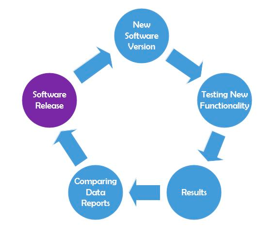

## Регрессионное тестирование

**Регрессионное тестирование** – это набор тестов, направленных на обнаружение дефектов в уже протестированных участках
приложения. Делается это совсем не для того, чтобы окончательно убедиться в отсутствии багов, а для поиска и исправления
регрессионных ошибок. Регрессионные ошибки – те же баги, но появляются они не при написании программы, а при добавлении
в существующий билд нового участка программы или исправлении других багов, что и стало причиной возникновения новых
дефектов в уже протестированном продукте.

Таким образом, мы можем сказать, что цель регрессионного тестирования – убедиться, что исправление одних багов не стало
причиной возникновения других и что обновление билда не создало новых дефектов в уже проверенном коде.

Есть несколько видов регрессионных тестов:

- Верификационные тесты. Проводиться для проверки исправления обнаруженного и открытого ранее бага.

- Тестирование верификации версии. Содержит принципы дымного тестирования и тестирование сборки: проверка
  работоспособности основной функциональности программы в каждой новой сборке.

- Непосредственно само регрессионное тестирование – повторное выполнение всех тестов, которые были написаны и проведены
  ранее. Они выполняются по уже существующим тест-кейсам независимо от того, были в ходе их прохождения найдены баги,
  или нет.

- Тестирование в новом билде уже исправленных багов в старых билдах. Это выполняется для того, чтобы проверить, не
  возобновило ли обновление билда старых дефектов.

Некоторые положения относительно того, как проводить регрессионное тестирование:

- Данный вид тестирования проводится в каждом новом билде.

- Начинать нужно с верификации версии (тестирование сборки и дымное тестирование).

- Проверка исправленных багов.

- Регрессионное тестирование, в основном, не покрывает все приложение, а только те участки, которые тем или иным
  способом «соприкасаются» с изменениями в билде.

Далее тестируются уже закрытые ранее баги.

1) Регрессионное тестирование рекомендуется проводить несколько раз (3-5). Поэтому, с целью экономии драгоценного
   времени (и, может быть, для избавления от «рутинности») в регрессионных тестах активно используют мощь автоматизации
   тестирования.

2) Проведение финального регрессионного тестирования, для которого отбираются тесты по приоритету, определяемому
   наибольшим количеством найденных ошибок.

Также регрессионное тестирование активно используется в экстремальной разработке.