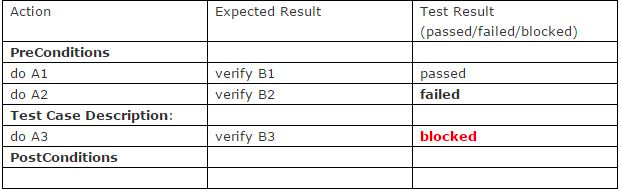

## Test Case

Еще одной обязательной сущностью, с которой столкнется каждый тестировщик, является Test Case(Тестовый случай).

**Test Case** – это тестовый артефакт, суть которого заключается в выполнении некоторого количества действий и/или
условий, необходимых для проверки определенной функциональности разрабатываемой программной системы.

Структура данного артефакта заключается в «троице»:

**Выполняемое действие (Action) – Ожидаемый результат (Expected result) – Фактический результат (Test result).**

Непосредственно сам тестовый случай состоит из 3 частей:

• **PreConditions** (Предусловия) – либо список шагов, которые приводят проверяемую систему в состояние, пригодное для
тестирования, либо список проверок условий того, что система уже находиться в необходимом состоянии.

• **Test Case Description** (Описание тестового случая) – список действий, с помощью которых осуществляется основная
проверка функционала (после которой и сверяется фактический результат с ожидаемым).

• **PostConditions** (Постусловия) – список действий, которые возвращают систему в исходное состояние.

Способ описания тест кейсов и их структура может в каждой компании или команде быть разным: иметь разные глубины
описания необходимых действий и результатов, иметь разные структурные составляющие. Но, хорошая структурированность и
высокая удобность шаблонов тестовых случаев, может весьма сократить время рутинных заполнений форм и повысить
эффективность команды в целом.