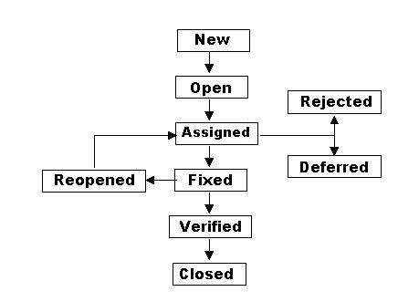

## Жизненный цикл дефектов

Итак, мы нашли баг. Может даже блокер. Что же с ним может случиться, на всём его нелегком жизненном пути? (Названия
этапов жизни дефектов могут быть разными в разных баг-трекинг системах, но суть их одна).

- **Новый (New)**. Тестировщик нашел баг, дефект успешно занесен в «Bug-tracking» систему.
- **Открыт (Opened)**. После того как тестировщик отправил ошибку, она либо автоматически, либо вручную назначается на
  человека который должен её проанализировать (обычно **Project Manager**). В зависимости от решения менеджера проекта,
  баг может быть:
- **Отложен (Deferred)**. Исправление этого бага не несет ценности на данном этапе разработки или по другим,
  отсрочивающим его исправление причинам.
- **Отклонен (Rejected)**. По разным причинам дефект может и не считаться дефектом или считаться неактуальным дефектом,
  что вынуждает отклонить его.
- **Дубликат (Duplicate)**. Если описанная ошибка уже ранее была внесена в «Bug-tracking» систему, то статус такой
  ошибки меняется на «дубликат».
- **Назначен (Assigned)**. Если ошибка актуальна и должна быть исправлена в следующей сборке (build), происходит
  назначение на разработчика который должен исправить ошибку.

Когда наличие дефекта неопровержимо, его путь может привести к следующим статусам:

- **Исправлен (Fixed)**. Ответственный за исправление бага разработчик заявляет, что устранил дефект.

В зависимости от того, исправил ли разработчик дефект, дефект может быть:

- **Проверен (Verified)**. Тестировщик проверяет, действительно ли ответственный разработчик исправил дефект, или
  все-таки разработчик безответственный. Если бага больше нет, он получает данный статус.
- **Повторно открыт (Reopened)**. Если опасения тестировщика оправданы и баг в новом билде не исправлен – он все так же
  потребует исправления, поэтому заново открывается.
- **Закрытый (Closed)**. В результате определенного количества циклов баг все-таки окончательно устранен и больше не
  потребует внимания команды – он объявляется закрытым.

Это и есть основные этапы жизненного цикла дефекта. Уверен, если Вы будете использовать данную градацию жизни несносных
багов, – вероятность того, что Вы успешно ответите на вопрос о “жизненном цикле багов” на собеседовании очень велика.

