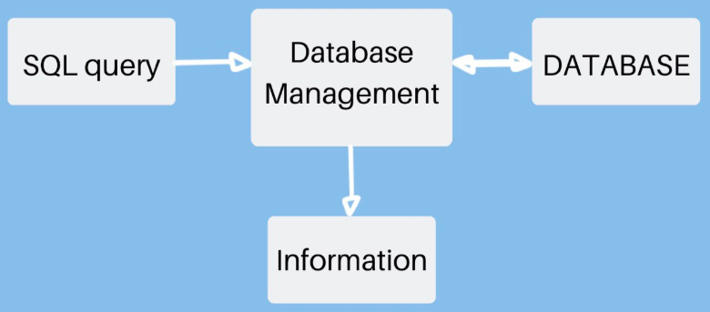

## Зачем нужен SQL для тестирования?

Каждая система должна иметь базу данных. Информация (сведения о пользователе, состояние транзакции) обычно
поддерживается в традиционных реляционных базах данных, таких как MySQL и Oracle.

**SQL** — это стандартный компьютерный язык для управления реляционными базами данных и обработки данных. SQL
используется для запроса, вставки, обновления и изменения данных. Вы можете думать о SQL как о средстве связи между
пользователем и СУБД (система управления БД).

Проще говоря, SQL — это язык программирования, с помощью которого мы обращаемся к нашей базе данных.

Чтобы определить SQL-запрос, нам сначала нужно понять, что такое запрос? Запрос может быть определен как запрос данных
из базы данных через СУБД. Запрос может рассматриваться как инструкция, отправляемая в СУБД для получения набора данных
на основе критериев. Такой запрос может быть разработан с использованием SQL и называется запросом SQL.

Простым примером SQL-запроса будет: Select * from Table.

Посмотрев на этот запрос, вы легко сможете понять, что он пытается сделать — выбрать все данные (представленные *) из
таблицы.

Когда вы проводите функциональное тестирование системы через frontend (веб-сайт, мобильные приложения и т.д.), вам также
необходимо проверить, правильно ли обновляются отправляемые вами данные в базе данных.

Спрос на универсальных тестировщиков растет. Это означает, что тестировщики должны иметь навыки тестирования
функциональности системы с помощью традиционных методов тестирования «наведи, щелкни и проверь», и уметь использовать
технические знания для проверки всех аспектов системы. Эти технические знания включают навыки проверки операционной
системы, интерфейса и базы данных. В данном случае мы подчеркнем важность хороших навыков языка структурированных
запросов (SQL).

**Насколько важны навыки SQL для тестировщика программного обеспечения?**

Некоторые приложения требуют сильных навыков проверки SQL, некоторые из них требуют средних навыков, а для некоторых
приложений знания SQL вообще не требуются.

Возьмем в пример веб-сайты, на которых размещаются документы, которые пользователи могут распечатать на принтере. Печать
этих документов требует, чтобы пользователи сначала установили специальный контроллер печати на свой ПК. В данном случае
работа тестировщика заключается в том, чтобы печатать документы из различных комбинаций операционных систем, браузеров и
принтеров и проверять качество печати документов. Для этого теста не нужно применять какие-либо навыки SQL. Опыт SQL
требуется для проверки тестовых данных, вставки, обновления и удаления значений тестовых данных в базе данных.

Рассмотрим работу над другим проектом, участие в бэкэнд-тестировании, где требуются сильные знания SQL-запросов.
Внутренний инструмент пользовательского интерфейса для получения данных из базы данных Oracle на основе входных
значений. В рамках тестирования сравниваются выходные данные инструмента пользовательского интерфейса и выходные данные
базы данных, вводятся одинаковые значения в инструмент и базу данных, чтобы убедиться, что инструмент функционировал
должным образом. Каждый раз, когда входные значения меняются, администратор базы данных дает группе тестирования очень
большие запросы с использованием оператора select. Для начала нужно понять связь между таблицами, столбцами и запросом,
прежде чем его использовать. Кроме того, нужно использовать различные типы операторов SQL для проверки тестовых данных.

**Следующие знания базы данных и SQL должны быть у тестировщика:**

- Он должен уметь распознать различные типы баз данных;
- Подключаться к базе данных с использованием разных клиентов SQL-соединений;
- Понимать отношения между таблицами базы данных, ключами и индексами;
- Умение написать простой оператор выбора или SQL вместе с более сложными запросами на соединение;
- Интерпретировать более сложные запросы.

**Наиболее используемые операторы SQL в тестировании:**

- **Data Manipulation Language (DML)**: используется для извлечения, хранения, изменения, удаления, вставки и обновления
  данных в базе данных. Примеры: операторы SELECT, UPDATE и INSERT.
- **Data Definition Language (DDL)**: используется для создания и изменения структуры объектов базы данных в базе
  данных. Примеры: операторы CREATE, ALTER и DROP.
- **Transactional Control Language (TCL)**: Управляет различными транзакциями, происходящими в базе данных. Примеры:
  операторы COMMIT, ROLLBACK.
- **Inner Join**: извлекает сопоставленные записи из обеих таблиц.
- **Distinct**: извлекает различные значения из одного или нескольких полей.
- **In**: этот оператор используется, чтобы найти значение в списке или нет.
- **Between**: этот оператор используется для получения значений в диапазоне.
- **WHERE**: указывает, какие строки получить.
- **Like**: этот оператор используется для выполнения сопоставления с шаблоном; он используется с оператором WHERE.
- **Order By Clause**: указывает порядок возврата строк, сортирует записи таблицы в порядке возрастания или убывания. По
  умолчанию порядок возрастает.
- **GROUP BY**: группирует строки, имеющие общее свойство, так что агрегатная функция может быть применена к каждой
  группе.
- **HAVING**: выбирает из групп, определенных оператором GROUP BY.
- **Aggregate Functions**: выполняет вычисление для набора значений и возвращает одно значение. Пример: Avg, Min, Max,
  Sum, count и т. д.

**SQL очень важен в тестировании программного обеспечения, потому что:**

- Проверка поможет понять, что данные, которые добавляются в форму (на frontend), добавляются на бэкэнд или нет.
  Например, при регистрации пользователя на сайте, некоторые поля пропущены, следовательно, мы видим какое-то сообщение
  об ошибке относительно регистрации пользователя. Также, если мы выполним SQL-запрос, то сможем сказать, что следующие
  поля пропущены, и есть некоторая ошибка в функциональном модуле регистрации пользователя.
- SQL помогает нам в получении тестовых данных. Например, если нужно проверить некоторые исправления для товаров,
  которые видны на работающем сайте. С помощью SQL-запроса, можно получить продукты с определенным условием (
  фильтрацией), и изменить описание товара одновременно всем записям.
- SQL помогает нам в автоматизации тестирования. Например, если нам нужно убедиться, что для платного
  зарегистрированного пользователя будет отображен флаг VIP после входа в систему. SQL поможет в том, что мы напрямую
  получим пользователя с этими определенными условиями из базы данных, а затем авторизуемся, используя данные, и просто
  проверим наличие или отсутствие флага VIP, вместо того чтобы создать нового пользователя и затем произвести оплату от
  его имени.
